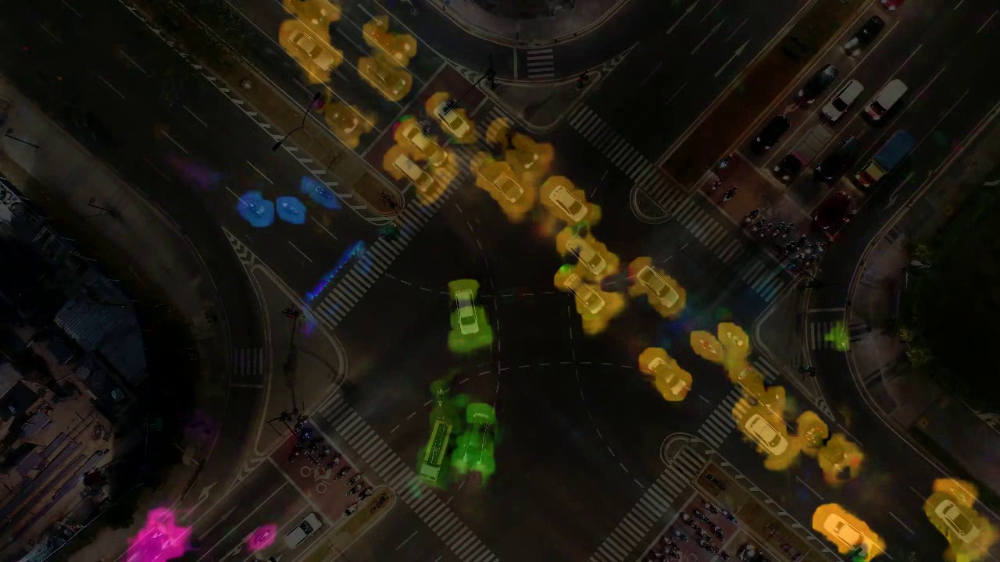
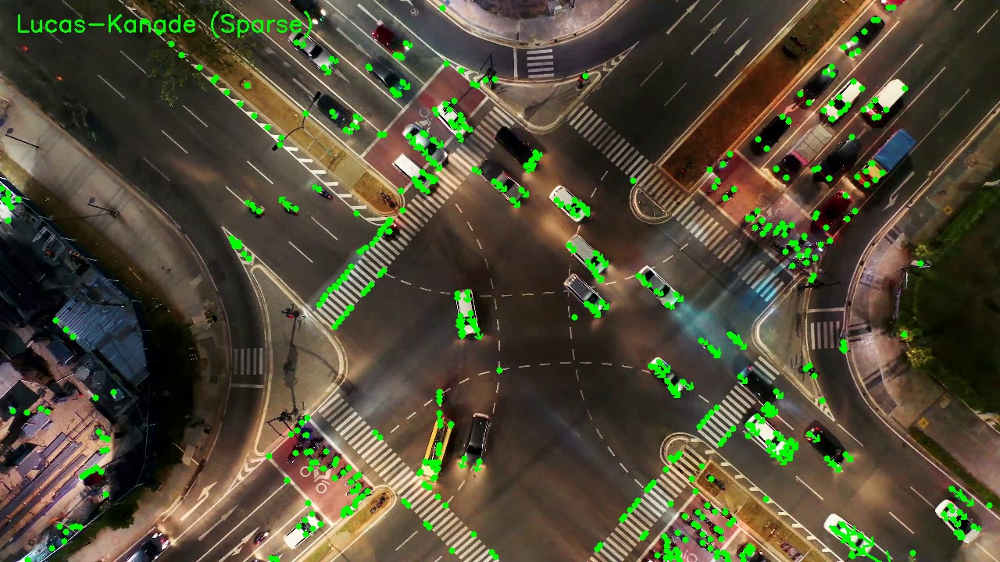
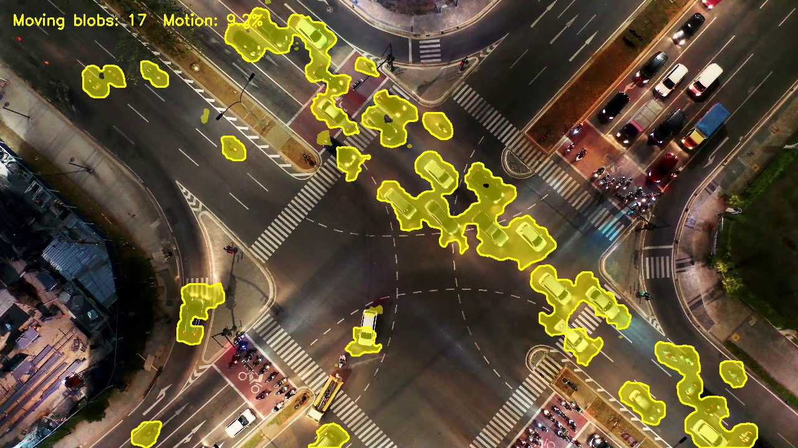
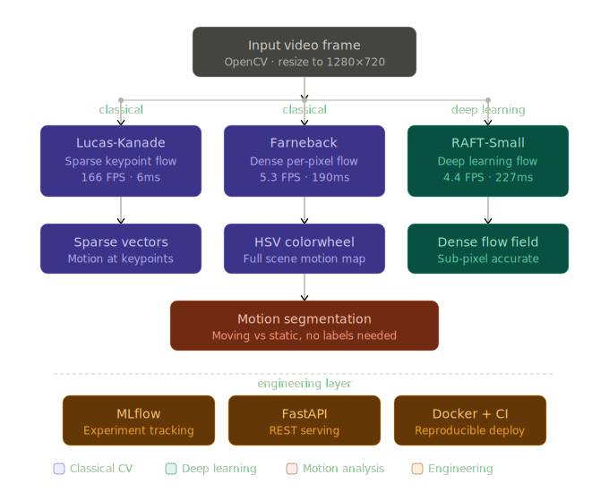

# Optical Flow and Motion Segmentation Pipeline

> Per-pixel motion estimation from traffic video using three methods —
> Lucas-Kanade sparse flow, Farneback dense flow, and RAFT deep learning flow —
> with motion segmentation, MLflow benchmarking, FastAPI serving, and Docker deployment.


---

## Demo

<div align="center">



*Farneback dense flow on a top-down intersection — each traffic stream appears in a distinct color.
Yellow = moving right, blue = moving left, green = curved approach, purple = bottom-to-top.
Static road surface and parked vehicles appear black — zero motion.*

</div>

---

## Three Methods, Three Outputs

<div align="center">

| Lucas-Kanade (sparse) | Farneback (dense) | Motion segmentation |
|:---:|:---:|:---:|
|  |  |  |
| Motion vectors at tracked keypoints | HSV colorwheel — hue=direction, brightness=speed | Binary moving vs static — no labels needed |

</div>

---

## What This Project Does

Optical flow is the task of estimating how each pixel moves between consecutive video frames.
This pipeline implements three fundamentally different approaches to that problem,
benchmarks them against each other using MLflow, builds a motion segmentation module
that separates moving objects from static background without any training data,
and serves the best model through a FastAPI REST endpoint.

---

## Pipeline Architecture

<div align="center">



*Three-branch pipeline — input frame processed by Lucas-Kanade, Farneback, and RAFT simultaneously.
Farneback output feeds into motion segmentation. All runs tracked in MLflow.*

</div>

---

## How Each Method Works

### Lucas-Kanade — sparse optical flow

Lucas-Kanade solves the **brightness constancy assumption**: a pixel keeps its intensity
as it moves, so `I(x, y, t) = I(x+dx, y+dy, t+1)`. For each frame, Shi-Tomasi corner
detection finds trackable keypoints — pixels with strong gradients in multiple directions
that are uniquely identifiable. The algorithm then searches a local window around each
point in the next frame to find where it moved.

The result is sparse — motion vectors exist only at detected corners, not everywhere.
This makes LK extremely fast (166 FPS) but incomplete. On aerial footage where
vehicles occupy few pixels, LK underperforms because corners concentrate on road
markings rather than vehicle surfaces. On ground-level dashcam footage, LK tracks
vehicle corners reliably frame-to-frame.

### Farneback — dense optical flow

Farneback approximates the neighborhood around every pixel using a polynomial:
`f(x) ≈ xᵀAx + bᵀx + c`. By fitting this polynomial in both frames and comparing
how the coefficients shift, it recovers a motion vector for every single pixel.

Output is a `(H, W, 2)` array — horizontal and vertical displacement per pixel.
Visualized using the HSV colorspace: hue encodes direction (0–360°), saturation
is fixed at maximum, and value (brightness) encodes magnitude. This gives the
characteristic colorwheel output where each traffic stream appears as a distinct
solid color. Static pixels have magnitude zero and appear black.

Farneback runs at 5.3 FPS — 31× slower than LK — because it computes flow for
every pixel rather than a sparse set of keypoints. The speed–completeness trade-off
is the fundamental choice between sparse and dense methods.

### RAFT — deep learning optical flow

RAFT (Recurrent All-Pairs Field Transforms) computes a correlation volume between all
pairs of features from two frames, then iteratively refines an initial flow estimate
using a recurrent GRU network. This gives sub-pixel accuracy and handles large
displacements that classical methods miss — but at a cost of 4.4 FPS on a GTX 1650.

Unlike LK and Farneback, RAFT was trained on labeled data (FlyingChairs, Sintel, KITTI)
and generalizes its learned priors about how objects move. The output is the same
`(H, W, 2)` format as Farneback, so the same visualization and segmentation pipeline
applies directly.

### Motion segmentation — no labels required

Given the dense flow field from Farneback, every pixel now has a motion magnitude:
`mag = sqrt(dx² + dy²)`. Pixels above a threshold are moving. Pixels below are static.
A Gaussian blur before thresholding removes noise. Morphological opening removes
isolated noise blobs. Morphological closing fills holes inside moving objects.

The result is a binary mask — moving vs static — derived entirely from geometry,
with no trained detector and no class labels. On the intersection video, 7–9% of the
scene is classified as moving at any given frame, matching the visible vehicle density.

---

## Benchmark Results

All methods benchmarked on GTX 1650 (4GB VRAM) at 1280×720, 100 frames each,
tracked automatically in MLflow.

| Method | Avg FPS | Avg Inference | Output type | Notes |
|---|---|---|---|---|
| Lucas-Kanade | 166.66 | 6ms | Sparse vectors | Fastest — keypoints only |
| Farneback | 5.27 | 190ms | Dense (H,W,2) | Complete scene coverage |
| RAFT-Small | 4.4 | 227ms | Dense (H,W,2) | Sub-pixel, learned priors |
| Segmentation thresh=0.8 | 4.96 | — | Binary mask | 11.2% avg motion |
| Segmentation thresh=1.2 | 5.04 | — | Binary mask | 9.8% avg motion |
| Segmentation thresh=2.0 | 4.97 | — | Binary mask | 7.6% avg motion |

LK is 31× faster than Farneback because it processes only ~500 keypoints per frame
versus all 921,600 pixels. The segmentation threshold controls sensitivity — lower
values detect more motion including noise, higher values detect only fast-moving objects.

---

## Key Concepts

| Concept | What it means here |
|---|---|
| Brightness constancy | Pixel intensity does not change as it moves — core assumption of LK and Farneback |
| Sparse vs dense | LK: vectors at N keypoints. Farneback/RAFT: vector at every pixel |
| HSV colorwheel | Hue=direction, value=speed. Static=black. Standard optical flow visualization |
| Viewpoint dependency | LK fails on aerial footage — vehicles too small for reliable corner detection |
| Motion segmentation | Thresholding flow magnitude separates moving from static without any labels |
| RAFT correlation volume | All-pairs feature matching gives sub-pixel accuracy at higher compute cost |

---

## Project Structure

```
optical-flow-pipeline/
│
├── src/
│   ├── flow_estimator.py      # LK, Farneback, RAFT wrappers
│   ├── visualizer.py          # HSV colorwheel, sparse vector drawing, overlay
│   ├── segmenter.py           # Motion mask from flow magnitude
│   ├── experiment_tracker.py  # MLflow wrapper
│   ├── profiler.py            # Per-frame FPS and timing logger
│   └── api.py                 # FastAPI REST endpoint
│
├── configs/
│   └── default.yaml           # All parameters — no hardcoded values
│
├── tests/
│   ├── test_flow_estimator.py # 11 tests — LK, Farneback, factory
│   ├── test_visualizer.py     # 17 tests — sparse, dense, overlay
│   └── test_segmenter.py      # 11 tests — mask, stats, apply
│
├── docs/                      # Pipeline diagram, sample frames
├── outputs/                   # Generated videos (gitignored)
├── data/                      # Input video (gitignored)
│
├── run_flow.py                # CLI entry — single, comparison, segmentation
├── run_benchmark.py           # MLflow benchmark runner
├── Makefile                   # 9 targets
├── Dockerfile                 # Reproducible container, uvicorn CMD
├── requirements.txt
└── .github/workflows/ci.yml   # GitHub Actions — tests on every push
```

---

## Setup

```bash
git clone https://github.com/SHIVCHAUDHARY17/optical-flow-pipeline.git
cd optical-flow-pipeline

python -m venv venv
venv\Scripts\activate          # Windows
source venv/bin/activate        # Linux / Mac

pip install torch torchvision --index-url https://download.pytorch.org/whl/cu121
pip install -r requirements.txt
```

Place your traffic video at `data/test_video.mp4`.

---

## Usage

```bash
# Lucas-Kanade sparse flow
python run_flow.py --mode single --method lucas_kanade

# Farneback dense flow
python run_flow.py --mode single --method farneback

# RAFT deep learning flow
python run_flow.py --mode single --method raft

# Side-by-side LK vs Farneback comparison
python run_flow.py --mode comparison

# Motion segmentation with blob stats
python run_flow.py --mode segmentation

# Benchmark all methods — results logged to MLflow
python run_benchmark.py

# View MLflow results in browser
mlflow ui --backend-store-uri mlruns
```

Or use Make:

```bash
make run-lk
make run-farneback
make run-raft
make run-segmentation
make benchmark
make test
```

---

## Configuration

All parameters in `configs/default.yaml` — nothing hardcoded.

```yaml
flow:
  method: farneback          # lucas_kanade | farneback | raft
  max_corners: 500           # LK: max keypoints to track
  quality_level: 0.1         # LK: corner quality threshold

segmentation:
  magnitude_threshold: 1.2   # pixels/frame to count as moving
  blur_kernel: 3
  morph_kernel: 5

video:
  resize_width: 1280
  resize_height: 720
```

---

## FastAPI serving

```bash
# Start the server
uvicorn src.api:app --reload

# Set a reference frame
curl -X POST http://localhost:8000/set-reference \
     -F "file=@data/frame_001.jpg"

# Get flow visualization for a new frame
curl -X POST http://localhost:8000/flow \
     -F "file=@data/frame_002.jpg" \
     --output flow_result.jpg
```

The API accepts any image pair and returns the Farneback HSV flow visualization as JPEG.
Interactive docs at `http://localhost:8000/docs`.

---

## Testing and CI

```bash
pytest tests/ -v
```

39 unit tests across flow estimator, visualizer, and segmenter — all using synthetic
numpy arrays, no video files required. GitHub Actions runs the full suite on every push.

---

## Docker

```bash
docker build -t optical-flow-pipeline .
docker run -p 8000:8000 optical-flow-pipeline
```

---

## Limitations

- Lucas-Kanade underperforms on aerial footage — vehicles too small for reliable
  corner detection. Farneback and RAFT are significantly more robust in this case.
- Farneback and RAFT produce relative motion — no absolute velocity in metres/second
  without camera calibration and known scene geometry.
- Motion segmentation assumes a stationary camera. Camera movement contaminates
  the flow field and produces false positives across the entire background.
- RAFT was designed for ground-level footage. Performance on very high aerial views
  may degrade compared to its benchmark results on KITTI and Sintel.

---

## What This Project Demonstrates

- Three optical flow methods implemented and benchmarked — sparse classical,
  dense classical, and deep learning — with real FPS numbers on a GTX 1650
- Dense flow motion segmentation without training data or class labels —
  pure geometric reasoning from flow magnitude
- MLflow experiment tracking integrated across all benchmark runs —
  parameters, metrics, and per-frame FPS curves logged automatically
- FastAPI REST endpoint serving flow inference — deployment-aware engineering
- 39 pytest unit tests using synthetic arrays — no video dependencies in CI
- Modular Python architecture with config-driven settings,
  Makefile, pre-commit hooks, GitHub Actions, and Docker

---

## Author

**Shiv Jayant Chaudhary** — Computer Vision and Machine Learning Engineer

[](https://linkedin.com/in/shiv1716)
[](https://github.com/SHIVCHAUDHARY17)
